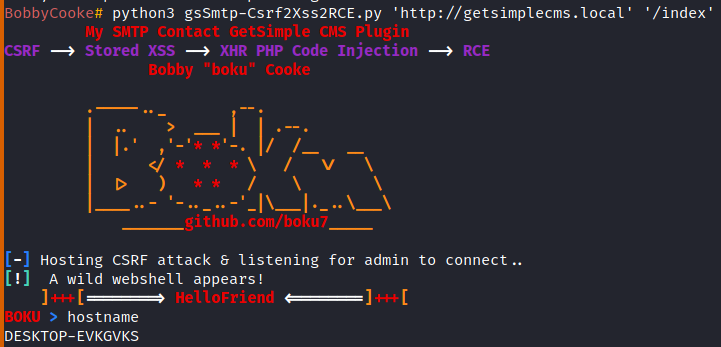

## GetSimple CMS My SMTP Contact Plugin <= v1.1.1 - CSRF to Stored XSS to RCE
##### Exploit Author: Bobby Cooke (boku)
##### Vulnerability Description:
+ The My SMTP Contact v1.1.2 plugin for GetSimple CMS suffers from a Stored Cross-Site Scripting (XSS) vulnerability, that when chained together with the CSRF vulnerability in v1.1.1, allows remote unauthenticated attackers to achieve Remote Code Execution on the hosting server, when an authenticated administrator visits a malicious third party website. The PHP function htmlspecialchars() attempts to sanitize the user-input, but is trivially bypassed by passing the dangerous characters as escaped hex bytes. This allows attackers to breakout of the HTML rendered by the PHP engine, to run arbitrary client-side code within the admins browser; after the admin submits the POST request from the CSRF attack. Since GetSimple CMS suffers from a known PHP code injection vulnerability within the themes edit page, the attacker can ride the admins session to perform a chain of XHR requests within the admins browser. The XHR chain triggered by the CSRF attack will collect the CSRF Token from the themes edit page, and use the token to exploit the PHP Code Injection vulnerability to upload a webshell within every page hosted by the CMS.
##### Vulnerability Statistics
+ CVSS Base Score: 9.6
+ CVSS v3.1 Vector: AV:N/AC:L/PR:N/UI:R/S:C/C:H/I:H/A:H

